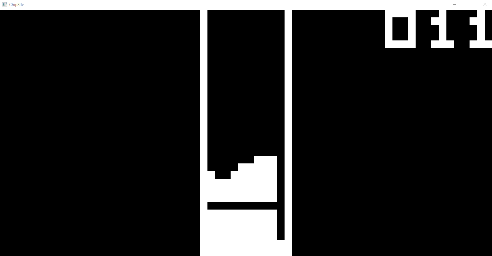

# Chip8tle

A Chip8 emulator for Windows written in C++ with no dependencies besides WinAPI and the C standard library.

ROMs from the internet are bundled in the repository and can be dragged and dropped on the compiled executable to start the emulator.
Credits for these ROMs are available in data/ReadMe.txt

Based on information available in _"Cowgod's Chip-8 Technical Reference v1.0"_ available here [http://devernay.free.fr/hacks/chip8/C8TECH10.HTM] at the time of writing.

# Screenshot

Chip8tle running _./data/TETRIS_

